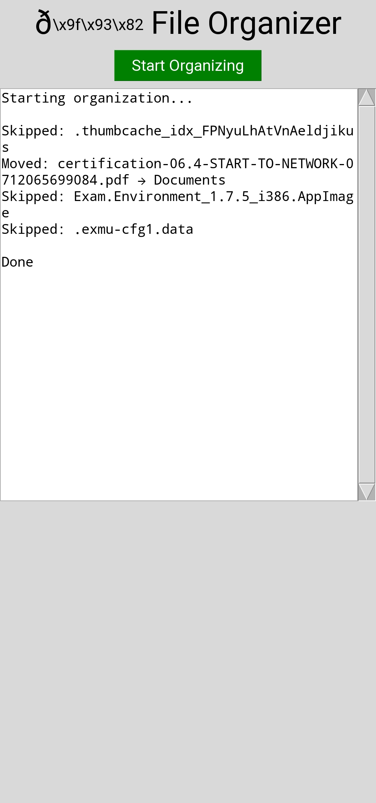

# 📂 File Organizer Tool (Python)

A simple Python GUI application that automatically organizes files in a Downloads folder into categorized folders.

---

## 🚀 Features
- Organizes files by type (Images, Documents, Videos, etc.)
- GUI interface (button-based)
- Safe file handling
- Works on Android (Pydroid 3)

---

## 📸 Preview
Here is what the app looks like:

---

## 🧠 Technologies Used
- Python
- Tkinter
- OS module
- Shutil

---

## ▶️ How to run
1. Install Python
2. Run `main.py`
3. Click "Start Organizing"

---

## 📌 Author
Built as a Python automation project for learning and portfolio use.
